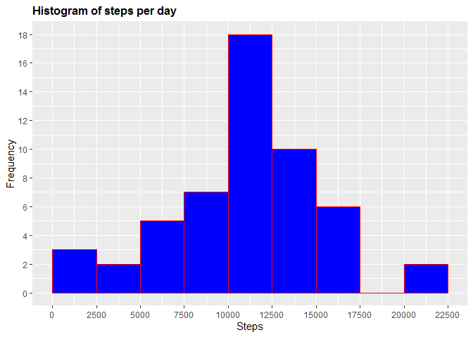
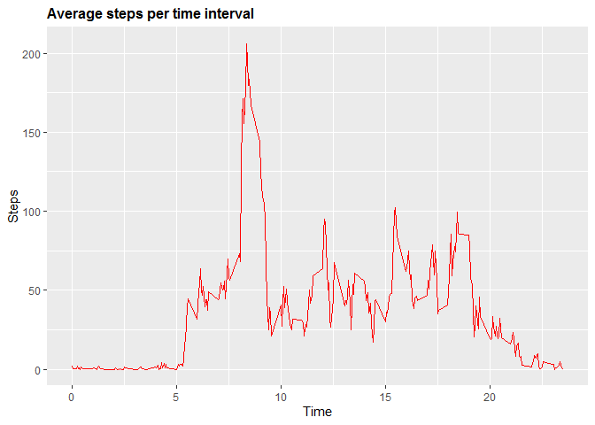
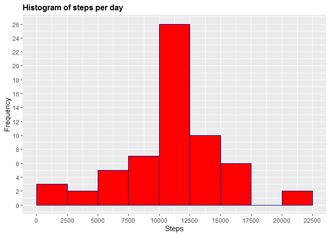
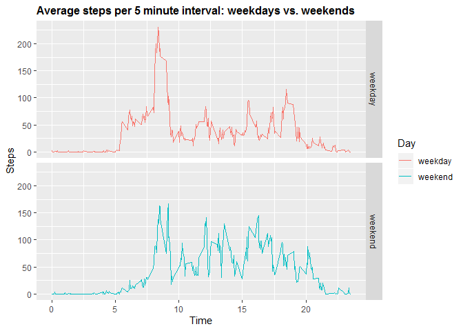

## Loading and preprocessing the data


```r
#loading data
activity <- read.csv("activity.csv")
# libraries
library(ggplot2)
library(dplyr)
```

```
## 
## Attaching package: 'dplyr'
```

```
## The following objects are masked from 'package:stats':
## 
##     filter, lag
```

```
## The following objects are masked from 'package:base':
## 
##     intersect, setdiff, setequal, union
```

Exploring the basics of this data

```r
dim(activity)
```

```
## [1] 17568     3
```

```r
names(activity)
```

```
## [1] "steps"    "date"     "interval"
```

```r
head(activity)
```

```
##   steps       date interval
## 1    NA 2012-10-01        0
## 2    NA 2012-10-01        5
## 3    NA 2012-10-01       10
## 4    NA 2012-10-01       15
## 5    NA 2012-10-01       20
## 6    NA 2012-10-01       25
```

```r
str(activity)
```

```
## 'data.frame':	17568 obs. of  3 variables:
##  $ steps   : int  NA NA NA NA NA NA NA NA NA NA ...
##  $ date    : Factor w/ 61 levels "2012-10-01","2012-10-02",..: 1 1 1 1 1 1 1 1 1 1 ...
##  $ interval: int  0 5 10 15 20 25 30 35 40 45 ...
```

## What is mean total number of steps taken per day?

### Calculating the total number of steps taken per day


```r
Steps_Day <- aggregate(activity$steps, list(activity$date), FUN=sum)
colnames(Steps_Day) <- c("Date", "Steps")
Steps_Day
```

```
##          Date Steps
## 1  2012-10-01    NA
## 2  2012-10-02   126
## 3  2012-10-03 11352
## 4  2012-10-04 12116
## 5  2012-10-05 13294
## 6  2012-10-06 15420
## 7  2012-10-07 11015
## 8  2012-10-08    NA
## 9  2012-10-09 12811
## 10 2012-10-10  9900
## 11 2012-10-11 10304
## 12 2012-10-12 17382
## 13 2012-10-13 12426
## 14 2012-10-14 15098
## 15 2012-10-15 10139
## 16 2012-10-16 15084
## 17 2012-10-17 13452
## 18 2012-10-18 10056
## 19 2012-10-19 11829
## 20 2012-10-20 10395
## 21 2012-10-21  8821
## 22 2012-10-22 13460
## 23 2012-10-23  8918
## 24 2012-10-24  8355
## 25 2012-10-25  2492
## 26 2012-10-26  6778
## 27 2012-10-27 10119
## 28 2012-10-28 11458
## 29 2012-10-29  5018
## 30 2012-10-30  9819
## 31 2012-10-31 15414
## 32 2012-11-01    NA
## 33 2012-11-02 10600
## 34 2012-11-03 10571
## 35 2012-11-04    NA
## 36 2012-11-05 10439
## 37 2012-11-06  8334
## 38 2012-11-07 12883
## 39 2012-11-08  3219
## 40 2012-11-09    NA
## 41 2012-11-10    NA
## 42 2012-11-11 12608
## 43 2012-11-12 10765
## 44 2012-11-13  7336
## 45 2012-11-14    NA
## 46 2012-11-15    41
## 47 2012-11-16  5441
## 48 2012-11-17 14339
## 49 2012-11-18 15110
## 50 2012-11-19  8841
## 51 2012-11-20  4472
## 52 2012-11-21 12787
## 53 2012-11-22 20427
## 54 2012-11-23 21194
## 55 2012-11-24 14478
## 56 2012-11-25 11834
## 57 2012-11-26 11162
## 58 2012-11-27 13646
## 59 2012-11-28 10183
## 60 2012-11-29  7047
## 61 2012-11-30    NA
```

### Plotting the histogram of total steps per day


```r
g <- ggplot(Steps_Day, aes(Steps))
g+geom_histogram(boundary=0, binwidth=2500, col="red", fill="blue")+ggtitle("Histogram of steps per day")+xlab("Steps")+ylab("Frequency")+theme(plot.title = element_text(face="bold", size=12))+scale_x_continuous(breaks=seq(0,25000,2500))+scale_y_continuous(breaks=seq(0,18,2))
```

```
## Warning: Removed 8 rows containing non-finite values (stat_bin).
```

<!-- -->

### mean and median of the total number of steps taken per day


```r
# Mean
mean(Steps_Day$Steps, na.rm=TRUE)
```

```
## [1] 10766.19
```

```r
#median
median(Steps_Day$Steps, na.rm=TRUE)
```

```
## [1] 10765
```

## What is the average daily activity pattern?

### time series plot of the 5-minute interval (x-axis) and the average number of steps taken, averaged across all days (y-axis)


```r
# creating table with steps per time
Steps_Time <- aggregate(steps~interval,data=activity,FUN=mean,na.action=na.omit)
# variable time
Steps_Time$time <- Steps_Time$interval/100
# plotting
h <- ggplot(Steps_Time, aes(time, steps))
h+geom_line(col="red")+ggtitle("Average steps per time interval")+xlab("Time")+ylab("Steps")+theme(plot.title = element_text(face="bold", size=12))
```

<!-- -->

### 5-minute interval, on average across all the days in the dataset, containing the maximum number of steps


```r
Steps_Time %>% select(time, steps) %>% filter(steps==max(Steps_Time$steps))
```

```
##   time    steps
## 1 8.35 206.1698
```

## Imputing missing values

### Calculate and report the total number of missing values in the dataset


```r
sum(is.na(activity$steps))
```

```
## [1] 2304
```
### strategy for filling in all of the missing values in the dataset


```r
activity$CompleteSteps <- ifelse(is.na(activity$steps), round(Steps_Time$steps[match(activity$interval, Steps_Time$interval)],0), activity$steps)
```
### Creating a new dataset that is equal to the original dataset but with the missing data filled in


```r
new_activity <- data.frame(steps=activity$CompleteSteps, interval=activity$interval, date=activity$date)
```
### histogram of the total number of steps taken each day

```r
Steps_Full <- aggregate(new_activity$steps, list(new_activity$date), FUN=sum)
colnames(Steps_Full) <- c("Date", "Steps")
#plotting
g <- ggplot(Steps_Full, aes(Steps))
g+geom_histogram(boundary=0, binwidth=2500, col="darkblue", fill="red")+ggtitle("Histogram of steps per day")+xlab("Steps")+ylab("Frequency")+theme(plot.title = element_text(face="bold", size=12))+scale_x_continuous(breaks=seq(0,25000,2500))+scale_y_continuous(breaks=seq(0,26,2))
```

<!-- -->
### Calculate and report the mean and median total number of steps taken per day

```r
#calculating mean
mean(Steps_Full$Steps)
```

```
## [1] 10765.64
```

```r
#calculating median
median(Steps_Full$Steps)
```

```
## [1] 10762
```
### Do these values differ from the estimates from the first part of the assignment? What is the impact of imputing missing data on the estimates of the total daily number of steps?

From the graph, it can be seen that there is a slight change between the interval 10000 and 12500 steps. depending on the mehos used to replace the missing values the change can vary.

## Are there differences in activity patterns between weekdays and weekends?

### Creating a new factor variable in the dataset with two levels – “weekday” and “weekend” indicating whether a given date is a weekday or weekend day.


```r
new_activity$newDate <- as.Date(new_activity$date, format = "%Y-%m-%d")
# creating a column with weekdays name
new_activity$weekday <- weekdays(new_activity$newDate)
# creating a column indicating weekday or weekend
new_activity$Day <- ifelse(new_activity$weekday=='Saturday' | new_activity$weekday=='Sunday', 'weekend','weekday')
```

### panel plot containing a time series plot of the 5-minute interval (x-axis) and the average number of steps taken, averaged across all weekday days or weekend days (y-axis)


```r
data <- aggregate(steps~interval+Day,data= new_activity,FUN=mean)
data$time <- data$interval/100
#plotting
g <- ggplot(data, aes(time, steps, color = Day))+geom_line()+ggtitle("Average steps per 5 minute interval: weekdays vs. weekends")+xlab("Time")+ylab("Steps")+theme(plot.title = element_text(face="bold", size=12))+facet_grid(Day ~ .)
print(g)
```

<!-- -->

